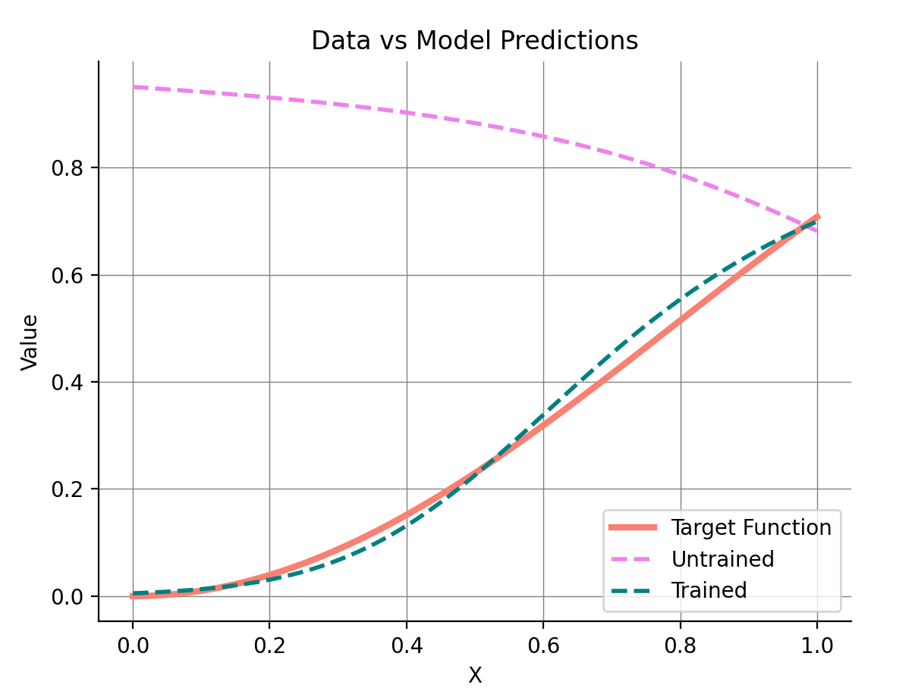
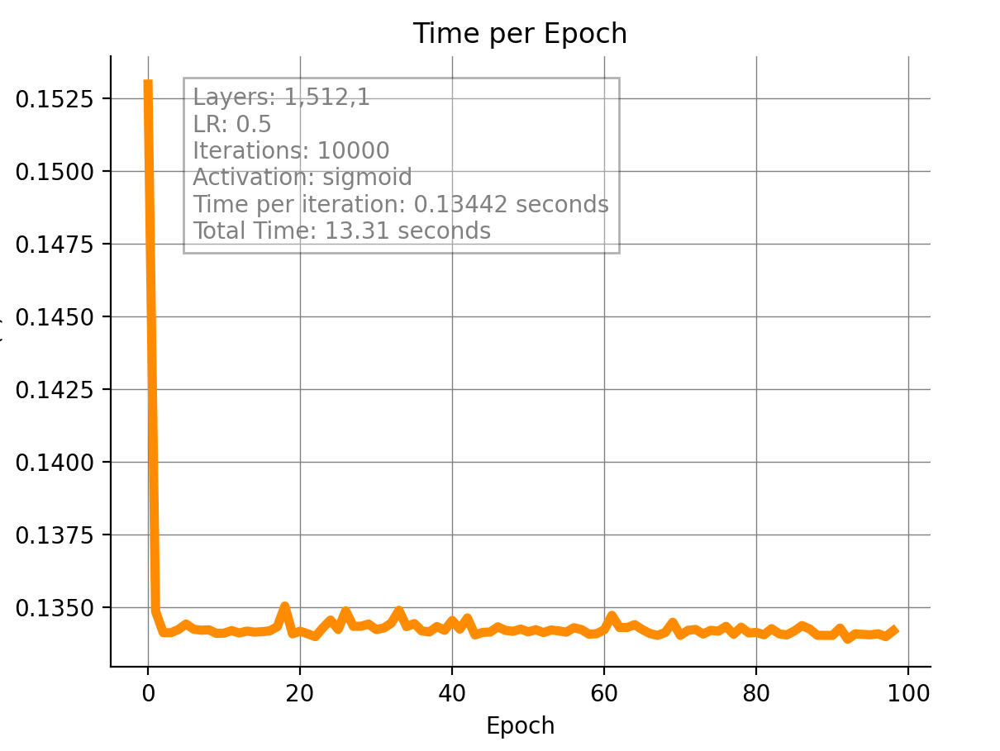
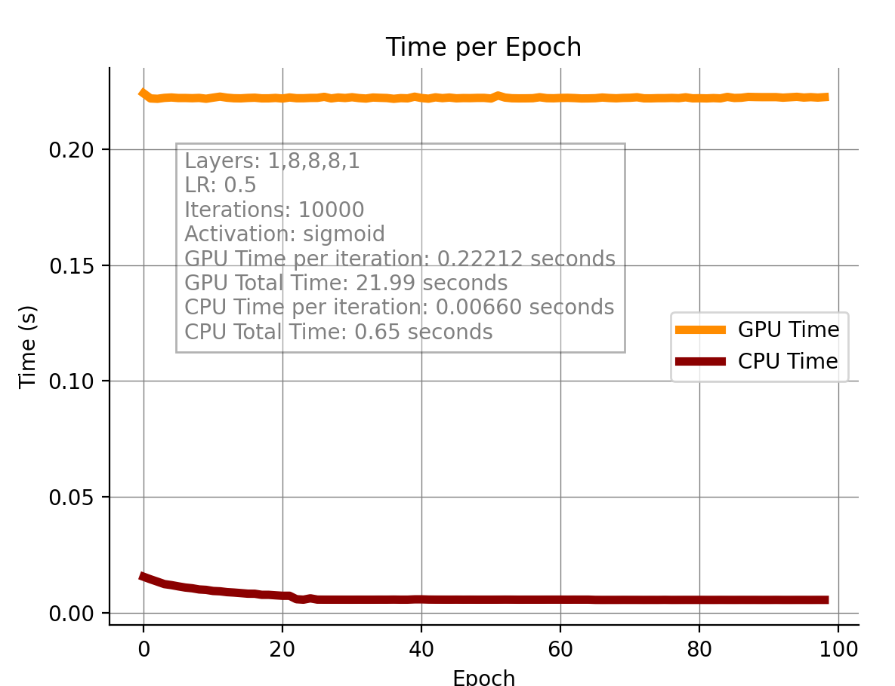
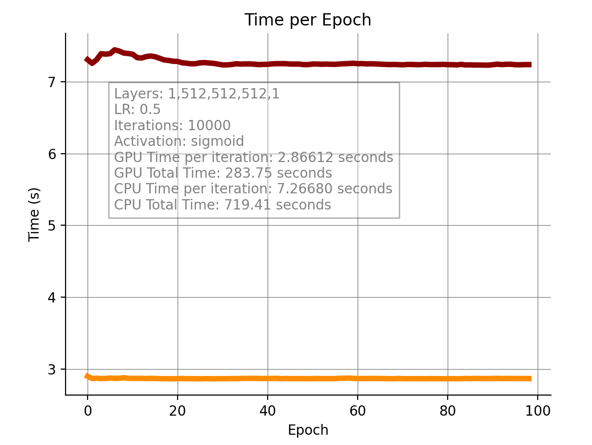

## CUDA-MLP
This project demonstrates a Multilayer Perceptron (MLP) implementation using C++ and CUDA, designed for academic purposes. By leveraging the parallel computing capabilities of CUDA, this MLP efficiently trains and evaluates using forward and backward propagation algorithms.

## Project Scope
The main goal of this project is to provide a simple yet effective implementation of an MLP to model and fit various trigonometric function. The dataset consists of a linear space of points, which is used for both training and testing the network.

## Performance 
he models using CUDA demonstrate significant advantages in computation times as the number of layers in the network increases, due to the heavy algebraic operations required.
The function used to measure the network's performance is `sin^⁡2`, and it is effectively fitted with nearly every configuration of layers, both with the CUDA-accelerated version and the standard CPU implementation. Below are some graphs illustrating the model's performance and the computation time. The network configuration used consists of the following dense layers: `[1, 512, 1]`.

<div style="display: flex; justify-content: space-between;">
  
  
</div>

## Comparison
How does the CUDA/CPU models compare? Simply put, using CUDA does make sense when operating with huge layers and thus huge algebric operation of various sorts. 
That because using CUDA comes with a cost, namely that of CUDA operations (such as CUDA Malloc, CUDA Memcpy, CUDA Launch and so on) performed on data. 
It does have sense then using such technology within the scope of large matrices and operations (such as images), otherwise the CPU it's just better for simple problems (and faster). 
In the image below, a simple comparison between a model composed of `[1,8,8,8,1]` neuron layers and a `[1,512,512,512,1]` one.

<div style="display: flex; justify-content: space-between;">
  
  
</div>

## Usage
Training, evaluating and plotting the results of the network is super simple. The entire network was written with efficiency and readability in mind and it's less than 150 lines of actual code, leveraging a custom matrix framework written from scratch. You can create a network, generating a dataset and evaluating the predictions in less than 10 lines of code!

```cpp
#include "net.h"

int main() {

// Init a vector containing the layers of the MLP
std::vector<size_t> layers = {1, 8, 8, 8, 1};

// Init an mlp object using the layers vector and a fixed lr and iterations
Net<float> mlp(layers, 0.5, 20000);

// Load the net on the gpu
mlp.cuda();

// init a data obj
Data<float> data;

// Generate a linspace of n points between a and b 
Matrix<float> X = data.linspace(0, 1, 100);

// Generate a target matrix using the sin^2(x) toy function
Matrix<float> Y = data.generate(X, "sin^2");

// Train the mlp using the generated data
mlp.train(X, Y);

// Generate n random sample to predict 
Matrix<float> sample = data.sample(5);

// Generate the actual target for the sample
Matrix<float> target = data.generate(sample, "sin^2");

// Predict the output of the sample
Matrix<float> prediction = mlp.predict(sample);

}
```

And then, if you want to print the results, you can just add those lines at the end of the code: 

```cpp
std::cout << "Input: " << std::endl;
sample.print();

// Print the prediction
std::cout << "Prediction: " << std::endl;
prediction.print();

// Print the actual target
std::cout << "Actual: " << std::endl;
target.print();
```
That's it!

### Dump information and plot
Obviously you can also display some graphs as the ones shown above in the performance/comparison tab. If you want to produce graphical information you have to run the ```plot_dump.cpp``` file instead of the main. The single difference is that not only it create, train and evaluate the network, but it also uses the <b>data<\b> custom library to load and dump the information on the disk. Specifically, it's almost identical to the previous initialization, but it does adds those lines ad the end of the file (instead of the prints): 

```cpp

// We save the model and it's information
mlp.save();

// We also save X, Y, and the prediction vectors to a csv file using the ID of the mlp object
// as identifier for the folder name
data.save(X.rawdata(), "X.csv", mlp.ID);
data.save(Y.rawdata(), "Y.csv", mlp.ID);
data.save(untrained_prediction.rawdata(), "untrained_Yhat.csv", mlp.ID);
data.save(prediction.rawdata(), "trained_Yhat.csv", mlp.ID);
```
It will then generate a folder named after the unique ID of the network (a random number) that you can just plot using the python script inside the folder as follows:

```python
python plot.py model_ID
```
And that's it! Nothing else.

## Compile
To compile this file, you just have to use the ```compile``` or (```compile_profiler``` if you need to dump the CUDA profiling log file) script in the source directory. The script directly uses CUDA to compile the main and link it to the .cu file. It just needs the file name as follow: 
```bash
./compile <main file>  <cuda file>
```
Or, simply put: 
```bash
./compile main cuda
```
Without extensions. This will generate a main file already linked that it's ran simply using ```./main```.

### Requirement to compile
The only thing required to compile, it's obviously a functioning CUDA installation. You should have ```$CUDA_HOME/``` in your environment.

## Additional information 
If you want to know more about why and how something works in the code, you can refer to the code itself to know more. It's <b>detailed and extensively commented</b> to an extent where the actual explanation doubles the lines of real code!

## Specifications
The model was built using the following specs:
- Quadro K5000
- Cuda 11.0

